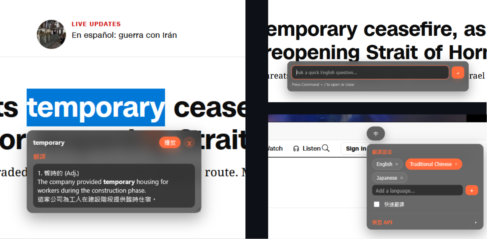
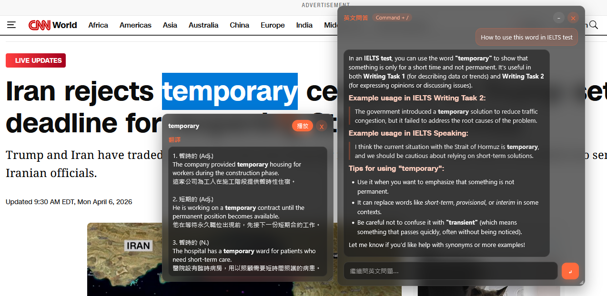

# Private AI Translator

A lightweight browser extension for Firefox and Chrome that translates selected text using a local or remote LLM API. It supports any OpenAI-compatible backend, including LM Studio, OpenAI, Google Gemini, and custom self-hosted servers.



---

## Features

### Translation
- Click-to-translate button appears near any text selection
- Draggable floating translation panel with close and TTS playback buttons
- **Fast Translate mode** — streamlined single-call translation for speed
- **Word mode** (default for single words) — two-stage pipeline:
  - Stage 1: meanings + part-of-speech, informed by the surrounding sentence
  - Stage 2: one example sentence per meaning with bold target word
- **Context-aware disambiguation** — passes surrounding sentence to the model so single words are translated in context

### Language Management
- Dynamic language pill UI — add or remove any target language at any time
- Preset languages with built-in UI labels: **Traditional Chinese**, **Japanese**, **English**
- For any custom language (e.g. Spanish, Korean, French) the extension auto-generates localized UI labels via the active LLM and caches them
- Pills show live generation state (pending `···` / failed `⚠`) and retry on click

### English Chat Assistant
- `Command + /` toggles the in-page English chat panel
- Quick launcher appears near the bottom of the page on first open
- Full chat panel is draggable (header) and resizable (bottom-right `◢` handle)
- Selection-aware: highlight text before opening chat and your question can reference it
- Markdown rendering: headings, lists, tables, code blocks, `---` dividers
- Minimize (`-`) hides the panel while keeping history; close (`×`) resets history

### API Providers
| Provider | Default Base URL | Default Model |
|---|---|---|
| LM Studio | `http://127.0.0.1:1234` | `qwen/qwen3-8b` |
| OpenAI | `https://api.openai.com` | `gpt-4.1-mini` |
| Google Gemini | `https://generativelanguage.googleapis.com` | `gemini-2.0-flash` |
| Custom | `http://127.0.0.1:1234` | `qwen/qwen3-8b` |

Each provider has its own saved profile (base URL, model, API key). Switching providers restores the last-used profile for that provider.

### Settings Panel
- Floating `Lang` button fixed to the right edge of the page — drag to reposition
- Expand to manage languages, toggle Fast Translate, and configure the API provider
- API section collapses to save space

### TTS Playback
- Uses the browser's built-in [Web Speech API](https://developer.mozilla.org/en-US/docs/Web/API/Web_Speech_API) (`speechSynthesis`) — no external server required
- Plays the original selected text when the **播放** button is clicked
- Only shown for single-word translations

---

## Requirements

- Firefox 109+ or any Chromium-based browser (Chrome, Edge, Brave, …)
- One LLM backend:
  - [LM Studio](https://lmstudio.ai) running locally
  - OpenAI API key
  - Google Gemini API key
  - Any self-hosted OpenAI-compatible API server

---

## Installation

### 1. Choose a browser manifest

```bash
# Firefox
./use-manifest.sh firefox

# Chrome / Chromium
./use-manifest.sh chrome
```

This copies the correct manifest into `manifest.json`. **Always run this before loading the extension.**

### 2. Load in Firefox

1. Open `about:debugging`
2. Click **This Firefox**
3. Click **Load Temporary Add-on…**
4. Select `manifest.json` in this folder

### 3. Load in Chrome

1. Open `chrome://extensions`
2. Enable **Developer mode** (top-right toggle)
3. Click **Load unpacked**
4. Select this folder

> Screenshot placeholder — Load Temporary Add-on in Firefox

---

## Setup

### Configure the API Provider

Open any webpage and click the **Lang** button on the right edge to open the settings panel.

1. Click the **Model API** section to expand it
2. Select your provider from the dropdown
3. Fill in the base URL, model name, and API key as needed

**LM Studio** — make sure LM Studio is running and a model is loaded. The default endpoint is `http://127.0.0.1:1234`. No API key required.

**OpenAI** — set your API key. The base URL defaults to `https://api.openai.com`.

**Google Gemini** — set your API key. The base URL defaults to `https://generativelanguage.googleapis.com`.

**Custom** — enter any OpenAI-compatible endpoint, model, and optional key.

> Screenshot placeholder — Settings panel with API section expanded

---

## Usage

### Translate Text

1. Select any text on a webpage
2. Click the small **翻譯** button that appears near the selection
3. The floating translation panel shows the result — drag it by its header to reposition
4. Click **播放** to hear the original text via browser TTS (single-word only)
5. Click **×** to close the panel

> Screenshot placeholder — translate button and floating result panel

### Change Target Language

1. Click the **Lang** button (right edge)
2. Click any language pill to switch to it
3. To add a new language, type it in the **Add a language…** field and press `Enter` or `+`
   - Custom languages auto-generate localized labels in the background
4. To remove a language, click **×** on its pill (at least one language must remain)

> Screenshot placeholder — language pill UI

### Chat Assistant

- Press `Command + /` to open the chat
- Type your question and press `Enter` to send
- Highlight text on the page first to ask questions about it
- Press `Command + /` again to toggle the panel; click `-` to minimize without clearing history; click `×` to reset

> Screenshot placeholder — chat panel

### Fast Translate Mode

Toggle **Fast Translate** in the settings panel.

| Mode | Sentence | Single Word |
|---|---|---|
| Off (default) | Translation prompt | Two-stage meanings + examples |
| On | Translation prompt | Fast word prompt (meaning + one example in context) |

---

## Customizing Prompts

All prompts are plain text files in `prompts/`. Use `{{target_language}}` where the target language name should appear.

| File | Purpose |
|---|---|
| `prompts/translate_system.txt` | System prompt for sentence translation |
| `prompts/translate_user.txt` | User message template for sentence translation |
| `prompts/word_system.txt` | System prompt for word mode |
| `prompts/word_user.txt` | User message template for word mode |
| `prompts/word_meaning.txt` | Stage 1 prompt — meanings + POS only |
| `prompts/word_example.txt` | Stage 2 prompt — example sentences |
| `prompts/word_fast.txt` | Fast word prompt (context-aware, single call) |
| `prompts/chat_system.txt` | System prompt for the chat assistant |
| `prompts/chat_user.txt` | User message template for chat |

After editing any prompt file, reload the extension in `about:debugging` or `chrome://extensions`.

---

## File Structure

```
manifest.json            Active manifest (copied from chrome/firefox variant)
manifest.chrome.json     Chrome MV3 manifest (background.service_worker)
manifest.firefox.json    Firefox manifest (background.scripts)
use-manifest.sh          Copies selected manifest into manifest.json

content.js               Shared state, constants, storage helpers, drag/resize, Markdown renderer
content.translate.js     Selection tracking, translate button, translation panel, TTS playback
content.chat.js          Chat launcher, chat panel, history management, rendering
content.settings.js      Language pill UI, settings panel, API profile management, storage sync
content.bootstrap.js     Content script runtime listeners and startup wiring
background.js            Provider-aware LLM requests, prompt loading, settings state, TTS relay

prompts/                 Editable plain-text prompt files
```

---

## Troubleshooting

**No translation appears**
- *LM Studio*: confirm LM Studio is running, a model is loaded, and the base URL matches.
- *OpenAI / Gemini*: confirm the API key is valid and the model name is correct.
- *Custom API*: confirm the server is OpenAI-compatible and reachable from the browser.

**Custom language pill stuck on `···`**
- The label generation request failed. Click the pill to retry. Check that your API provider is configured and reachable.

**No TTS audio**
- TTS uses the browser's built-in `speechSynthesis` API. Make sure your browser supports it (all modern browsers do).
- On some systems the browser may have no voices installed — check `speechSynthesis.getVoices()` in the browser console.

**Chat table not rendering correctly**
- Ensure the model returns a plain Markdown table (not wrapped in a fenced code block).

**Changes to prompt files have no effect**
- Reload the extension after editing prompt files or any `content*.js` file.

**Firefox error about `background.service_worker`**
- Run `./use-manifest.sh firefox`, then reload the temporary add-on.

**`Could not establish connection. Receiving end does not exist.`**
- *Chrome*: confirm you loaded the Chrome manifest (`./use-manifest.sh chrome`).
- *Firefox*: run `./use-manifest.sh firefox`, then reload the temporary add-on.
